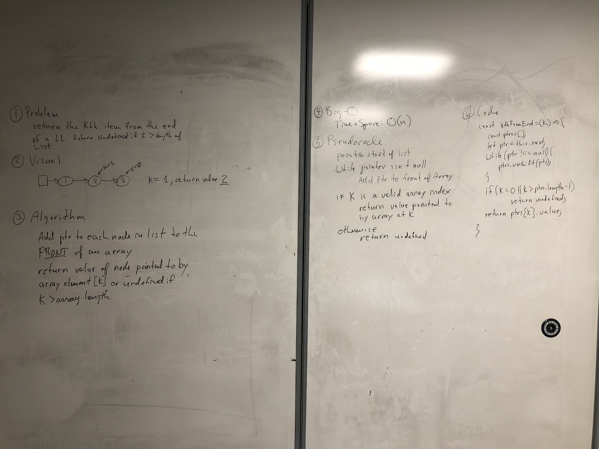

## Linked List return kth from end

Create a method that returns the kth item from the end of a linked list.

## Challenge

k-th value from the end of a linked list.

## Solution

Travis testing enabled.

