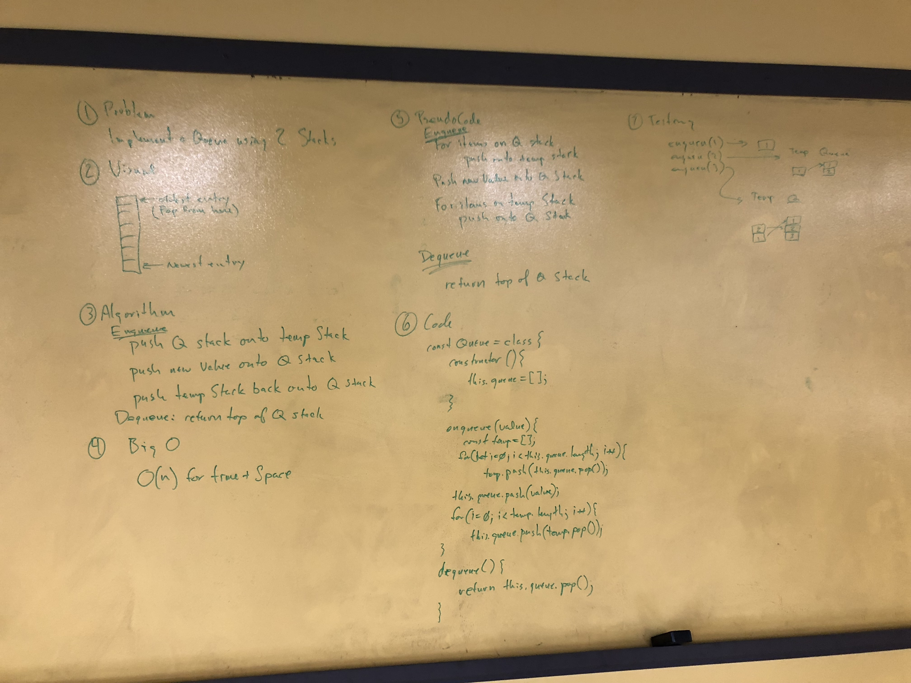

## Merge 2 linked lists

Implement a queue using two stacks.

## Challenge

Create class Queue which, under the hood, uses two stacks and pop and push methods to implement enqueue and dequeue.

## Solution

Travis testing enabled.

