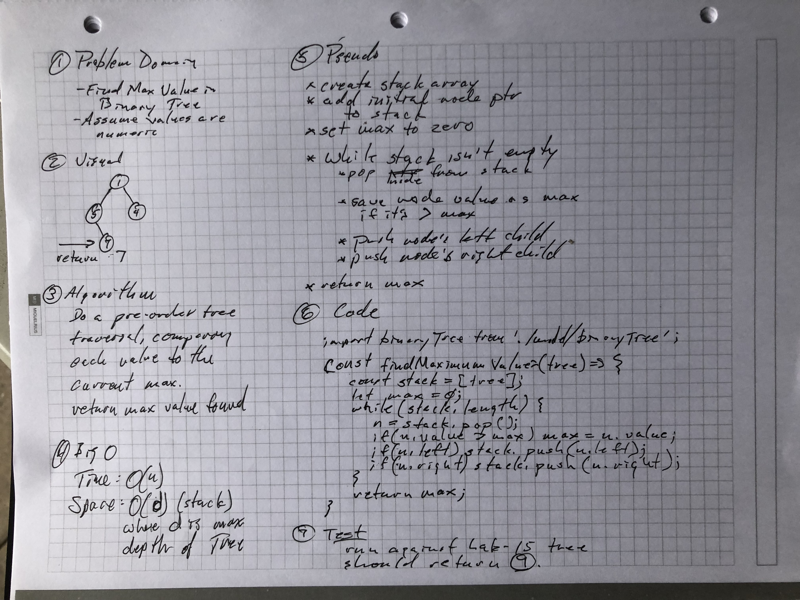

## Find Maximum Value Binary Tree

Find maximum value in a binary tree. 

## Challenge

Write a function called find-maximum-value [sic] which takes binary tree as its only imput. Without utilizing any of the built-in methods available to your language, return the maximum value stored in the tree. You can assume that the values stored in the Binary Tree will be numeric.

## Solution

Travis testing enabled.

