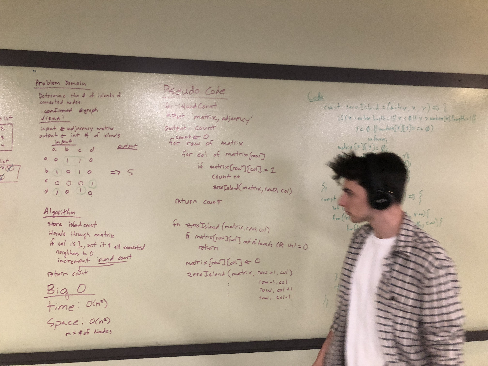

## Problem Domain

Determine the number of Islands of connected nodes.

## Challenge

Create a function that brings an an adjacency matrix and determines whether or not there are any islands. Without utilizing any of the built-in methods available to your language, return the number of islands present in the graph data structure.

## Solution

Travis testing NOT enabled.

No code written, white board only:

